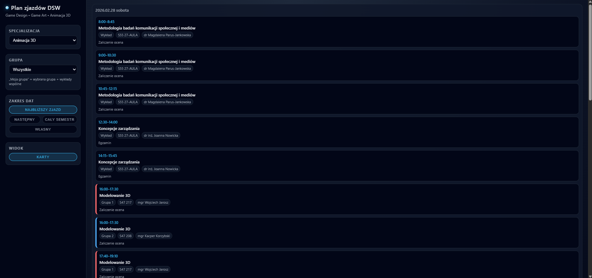
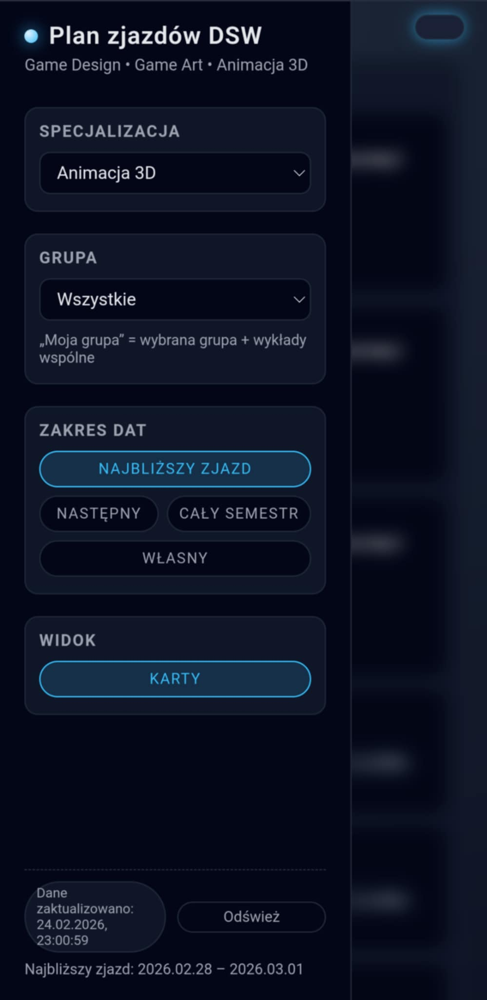

# 🚀 EduFlow – inteligentny harmonogram zjazdów DSW

EduFlow automatycznie pobiera, przetwarza i prezentuje plan zjazdów DSW w nowoczesnej, przejrzystej formie.  
Zero chaosu — tylko szybki dostęp do tego, co naprawdę ważne.

---

# 📑 Spis treści

- [Wsparcie projektu](#-wsparcie-projektu)
- [Linki](#-linki)
- [Najważniejsze funkcje](#-najważniejsze-funkcje)
- [Technologie](#-technologie)
- [Architektura systemu](#-architektura-systemu)
  - [Backend](#backend)
  - [Frontend](#frontend)
- [Tryb mobilny](#-tryb-mobilny)
- [Funkcje interfejsu](#-funkcje-interfejsu)
- [Build i deployment](#-build-i-deployment)
- [Roadmap](#-roadmap)
- [Zrzuty ekranu](#-zrzuty-ekranu)
- [Licencja](#-licencja)

---

## ☕ Wsparcie projektu

👉 https://buycoffee.to/p4steo

---

## 🔗 Linki

- **Aplikacja online:** https://p4steo.github.io/EduFlow/  
- **API:** https://eduflow-qivy.onrender.com/plan  
- **Changelog:** https://github.com/p4steo/EduFlow/blob/main/CHANGELOG.md  
- **Licencja:** https://github.com/p4steo/EduFlow/blob/main/LICENSE  
- **Zgłaszanie podatności:** https://github.com/p4steo/EduFlow/discussions/categories/security-zg%C5%82aszanie-podatno%C5%9Bci  
- **Dyskusje / Q&A:** https://github.com/p4steo/EduFlow/discussions  
- **Zgłaszanie błędów:** Issues → Bug Report  
- **Propozycje funkcji:** Issues → Feature Request  

---

## ⭐ Najważniejsze funkcje

- 📅 Automatyczne wykrywanie najbliższego zjazdu  
- 🔁 Obliczanie następnego zjazdu  
- 🗂 Filtrowanie po grupach i wykładach wspólnych  
- 🎴 Widok kart z przejrzystym grupowaniem po dniach  
- 📱 Dedykowany tryb mobilny z wysuwanym panelem filtrów  
- 🌫 Rozmycie tła (blur overlay) podczas otwartego sidebaru  
- ⚠️ Oznaczanie zajęć odwołanych  
- 🔄 Ręczne odświeżanie danych  
- 🕒 Informacja o ostatniej aktualizacji  
- 💾 Cache danych (localStorage) z automatycznym wygaszaniem  
- 📡 Tryb offline z fallbackiem do `data.json`  
- 🎨 Podświetlanie aktualnie trwających zajęć  
- 🔍 Zaawansowane filtrowanie zakresu dat  

---

## 🧰 Technologie

**Frontend:** HTML, CSS, JavaScript  
**Backend:** FastAPI, Python, BeautifulSoup4, Requests  

---

## 🧱 Architektura systemu

### Backend
- Pobiera oficjalny harmonogram DSW  
- Parsuje PDF/HTML do JSON  
- Cache po stronie serwera  
- API przyjazne frontendowi  

### Frontend
- Pobiera dane z API z retry + fallback  
- Przechowuje dane w localStorage (6h TTL)  
- Renderuje widok kart  
- Obsługuje tryb offline  
- Wykrywa najbliższy i następny zjazd  
- Pełny tryb mobilny  

---

## 📱 Tryb mobilny

- Wysuwany sidebar  
- Rozmycie tła  
- Blokada scrolla  
- Automatyczne zamykanie sidebaru  
- Pełna obsługa inputów  

---

## 🧪 Funkcje interfejsu

### Widok kart
- Grupowanie po dacie  
- Sortowanie po godzinach  
- Kolorowe oznaczenia grup  
- Podświetlanie aktualnych zajęć  
- Oznaczanie odwołanych zajęć  

---

## 🛠 Build i deployment

- Frontend: GitHub Pages  
- Backend: Render.com  
- Service Worker z auto‑update  
- Cache busting przez `?_=timestamp`  

---

## 🧹 Roadmap

- 🔔 Powiadomienia o zmianach  
- 📆 Eksport do ICS  
- 🌓 Tryb jasny / ciemny  
- 🔍 Wyszukiwanie po przedmiotach  
- 🧪 Testy jednostkowe i e2e  

---

## 📸 Zrzuty ekranu

### Widok desktopowy

### Widok mobilny

### Panel filtrów

---

## 📜 Licencja

Projekt dostępny na licencji **BSD**.  
Pełny tekst licencji: https://github.com/p4steo/EduFlow/blob/main/LICENSE
